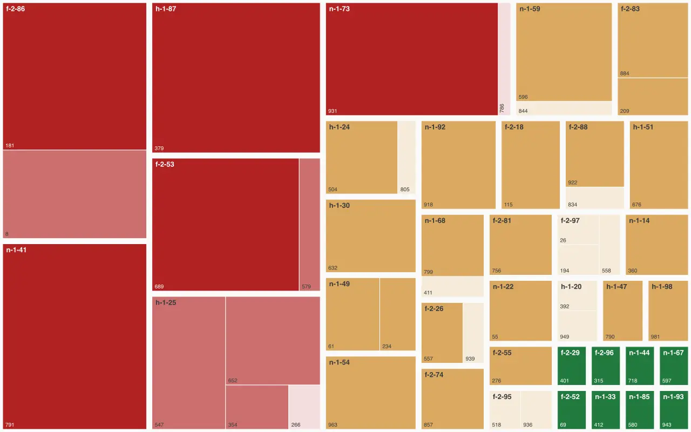

🇬🇧 English | 🇩🇪 [Deutsch](README.md)

# gelkao CLI

[](https://github.com/gelkao/cli/actions/workflows/ci.yml)
[](https://gist.github.com/dominikzalewski/696b0e161d53e5b752b2c6bc7c0fbf74)

**A zero trust swiss army knife for everything Hetzner won't tell you about your own account.**

No account, no login, nothing uploaded - it reads what you already have, computes
on your machine, and exits. Grep the source to prove it.

**Questions? [GitHub Discussions](https://github.com/gelkao/cli/discussions) or [private message on the Hetzner forum](https://forum.hetzner.com/wcf/index.php?conversation-add/&userID=41011).**

[Website](https://gelkao.com) |
[Documentation](https://gelkao.com/docs/latest/)

## Features

| Command | Question |
|---|---|
| [`gelkao volume`](https://gelkao.com/docs/latest/volume/) | What fails together? |
| [`gelkao invoice`](https://gelkao.com/docs/latest/invoice/) | What are you overpaying? |

The manual is written in German.

## Quick start

### gelkao volume

The placement table Hetzner support sends you on request tells you which of your
volumes hang off the same network switch. There is an example for that in the
repo too:

```
./gelkao volume draw < examples/example-volumes-real-fleet.tsv
./gelkao volume show < examples/example-volumes-real-fleet.tsv
```

<p align="center"></p>

<p align="center">🟥 too many volumes on one leaf · 🟧 watch it · 🟩 fine</p>

### gelkao invoice

Try it first with no account - the repo ships a small synthetic fleet you can audit on a fresh clone:

```
./gelkao invoice audit -q -d examples
```

Then run it on your own bill.

- Go to: https://accounts.hetzner.com/invoice
- Save the page as HTML into the `data/` directory

<p align="center"></p>

- Run `cat data/*.html | ./gelkao invoice audit -`

<p align="center"></p>

<p align="center">🟥 ≥ 50% · 🟧 20–49% · 🟩 under 20%</p>

Power users: `cat data/*.html | ./gelkao invoice list | ./gelkao invoice fetch && ./gelkao invoice audit`

## Real-world example

[Can you build a fault-tolerant system on a small budget on Hetzner Cloud?](https://gelkao.com/blog/is-it-possible-to-build-fault-tolerant-budget-system-on-hetzner-cloud/)
(German) maps a real 199-volume fleet: six switches carry more than half of them,
one of them 24 on its own.

[You're probably on the wrong Cloud box](https://gelkao.com/blog/how-cost-efficient-is-mytimeplan-com-cloud/)
is a case study of [mytimeplan.com](https://mytimeplan.com)'s real Hetzner fleet.
Exact numbers: 14 months, 193 boxes, €1,878/mo, **23% overpaid.**

## Share your number

Ran an audit? Post your result in [Discussions](https://github.com/gelkao/cli/discussions/11) - no email, nothing uploaded, just what you choose to paste.

## Requirements

`gelkao` is a small shell tool with a few standard dependencies:

- **bash** 3.2+ - the macOS system bash works.
- **sqlite3** 3.8.3+ - runs the audit and ranks the placement table; both commands need it.
- **curl** - to download invoices (`fetch`) and, if you accept the optional price refresh, the price tables; decline the prompt or pass `-q` and the audit stays fully offline.
- **rsvg-convert** and **cwebp** - only for `gelkao volume draw`, which renders the map as WebP. `gelkao volume show` and everything under `invoice` do not need them.
- standard POSIX tools (`grep`, `sed`, `head`), present on any Unix.
- **Windows:** run it inside WSL (Windows Subsystem for Linux); it then behaves exactly like the Linux setup above.

## Your data stays on your disk

`gelkao` runs entirely on your machine - it's a local command-line tool, not a SaaS dashboard. No account, no login, nothing uploaded.

- **Download-only:** every request it makes is a plain HTTP GET — it downloads your invoices from
Hetzner and, if you let it, the public Hetzner price tables from `gelkao.com`, and uploads nothing.
That price refresh is an interactive prompt (`[Y/n]`); decline with `n`, or skip it entirely with
`-q` or any non-interactive run (a pipe, CI).
- **Billing data stays in `data/`**, which is gitignored — keep it out of version control, tickets,
and shared locations.
- **No gelkao account or password:** an invoice is fetched with two secrets you already hold — its
`usage.hetzner.com/<uuid>` link and your customer number (`K…`) - which together act like a second
factor.

Found a security issue, or want to verify these claims yourself? See [SECURITY.md](SECURITY.md).

## Tests

The unit and report tests are hermetic — no network, no credentials — and run in
CI on every push (Linux and macOS). The integration test needs a real customer
number and a saved invoice page, secrets that must never reach a public CI runner,
so it runs only on your machine:

```
INVOICE_HTML=data/your-invoices.html bats tests/*.bats
```

- `gelkao` shares its logic with `lib.sh`.
- `tests/unit.bats` covers those functions with no network and no credentials.
- `tests/volume.bats` covers parsing the placement table, the tree, and the treemap's colour and layout logic.
- `tests/report.bats` covers the audit report's field stats and assembled output.
- `tests/badge.bats` covers the badge builder's pure logic.
- `tests/integration.bats` requires a real customer number and a real invoice HTML page.

### Integration badge

Because the integration test can't run in cloud CI, `./badge.sh` runs it locally
and publishes the pass-count to a gist that backs the README's integration badge —
so the badge reflects a real run against real invoices, not CI:

```
INVOICE_HTML=data/your-invoices.html ./badge.sh
```

## References

- [Hetzner 2024-10 Billing System Changes](https://docs.hetzner.com/general/billing-and-account-management/billing-at-hetzner/billing-system-hetzner/)
- [Hetzner Cloud API — Rate Limiting (3600 requests/hour)](https://docs.hetzner.cloud/#rate-limiting)

## License

Licensed under the Apache License 2.0 — see [LICENSE](LICENSE) and [NOTICE](NOTICE).
